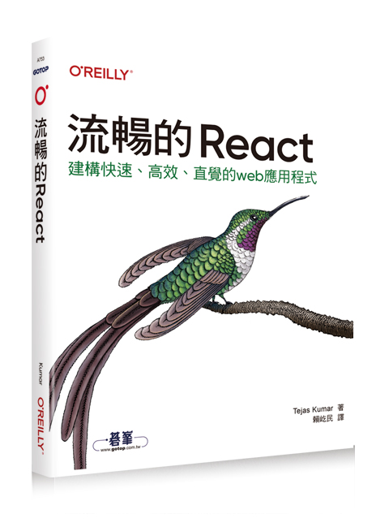
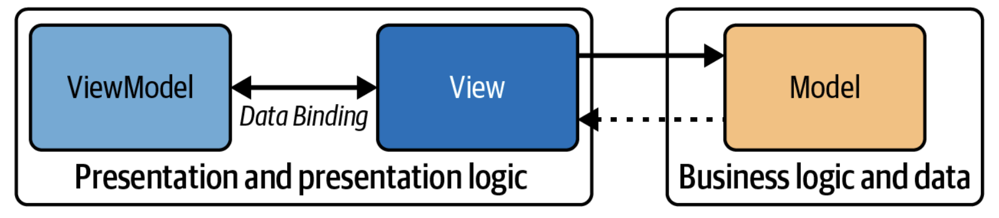

---
theme: default
background: https://images.unsplash.com/photo-1633356122544-f134324a6cee?w=1920
class: text-center
highlighter: shiki
lineNumbers: true
info: |
  流暢的 React 第一章 - 第二章
drawings:
  persist: false
transition: slide-left
title: 流暢的 React 第一章 - 第二章
mdc: true
---

<div class="grid grid-cols-2 gap-8 h-full items-center">
  <div>
    
  </div>
  
  <div>
  <h1>流暢的 React</h1>
    <p>第一章 基本內容 - 第二章 JSX</p>
    <p>Lois</p>
    <div class="pt-12">
      <span @click="$slidev.nav.next" class="px-2 py-1 rounded cursor-pointer" hover="bg-white bg-opacity-10">
        Start <carbon:arrow-right class="inline"/>
      </span>
    </div>
  </div>
</div>

---
layout: center
---

# 第一章：基本內容


---
layout: two-cols
---

# 為什麼會有 React？

<v-clicks>

- **一言以蔽之：更新**
- 網路時代的蠻荒時期之靜態網頁：填表單 → 提交 → 重新載入
- 現代需求：即時、敏捷的用戶體驗

</v-clicks>

::right::

<v-clicks>

### 三大挑戰

</v-clicks>

<br />

<v-clicks depth="2">

1. **效能問題**
   - DOM 操作造成 reflow 和 repaint <a href="https://www.explainthis.io/zh-hant/swe/repaint-and-reflow" target="_blank">補充資料</a>
   - 頻繁更新導致效能瓶頸

2. **可靠性問題**
   - 狀態追蹤困難
   - 多人協作時難以維護一致性

3. **資訊安全**
   - XSS 和 CSRF 攻擊風險
   - 需要對所有注入內容進行消毒

</v-clicks>


---

# React 之前的世界

一個簡單的 Like 按鈕需要考慮的狀態

<v-clicks>

```html
<button id="likeButton">Like</button>
```

</v-clicks>

<br />

<v-clicks>

### 四種可能的狀態

</v-clicks>

<v-clicks depth="2">

1. **按下前** - 預設狀態
2. **等待處理** - 已按下但操作未完成
3. **成功** - 操作完成，可能變綠色
4. **失敗** - 操作失敗，可能變紅色

</v-clicks>

<br />

<v-clicks>

### 需要處理的事項

</v-clicks>

<v-clicks depth="2">

- 使用 DOM API 找到按鈕：`document.querySelector` 或 `document.getElementById`
- 附加事件監聽器
- 事件發生時，執行狀態更新
- 刪除事件監聽器並清理任何狀態

</v-clicks>

---

# 傳統方式實作 Like 按鈕

<v-click>
````md magic-move {at:5, lines: true}
```html
<button id="likeButton">Like</button>
```
</div>
```html
<button id="likeButton" data-liked="false">Like</button>
```
````
</v-click>

<div class="overflow-y-auto" style="max-height: 400px;">
<v-click>

````md magic-move {lines: true}
```js {1-2|3-3|all|all}
const likeButton = document.getElementById("likeButton");
likeButton.addEventListener("click", () => {
 likeButton.textContent = "Liked";
});
```

讓 like 可以 unlike

```js {all|3-5}
counst likeButton = document.getElementById("likeButton");
likeButton.addEventListener("click", () => {
 const liked = likeButton.getAttribute("data-liked") === true;
 likeButton.setAttribute("data-like", !liked);
 likeButton.textContent = liked ? "Like" : "Liked";
});
```

讓 liked 狀態存入資料庫
先使用 XMLHttpRequest 和 var 還原當時的時空背景

```js {all}
const likeButton = document.getElementById("likeButton");
likeButton.addEventListener("click", () => {
  var liked = likeButton.getAttribute("data-liked") === "true";

  // 透過網路來溝通
  var xhr = new XMLHttpRequest();
  xhr.open("POST", "/like", true);
  xhr.setRequestHeader("Content-Type", "application/json;charset=UTF-8");
  xhr.onload = function () {
    if (xhr.status >= 200 && xhr.status < 400) {
      // 成功
      likeButton.setAttribute("data-liked", !liked);
      likeButton.textContent = liked ? "Like" : "Liked";
    } else {
      // 到達目標伺服器，但它回傳錯誤
      console.error("Server returned an error:", xhr.statusText);
    }
  };
  xhr.onerror = function () {
    // 有某種連接錯誤
    console.error("Network error.");
  };
  xhr.send(JSON.stringify({ liked: !liked }));
});
```

fetch API 於 2015 年引入
採取現代化的寫法

```js {all}
const likeButton = document.getElementById("likeButton");
likeButton.addEventListener("click", () => {
  const liked = likeButton.getAttribute("data-liked") === "true";

  // 透過網路進行溝通
  fetch("/like", {
    method: "POST",
    body: JSON.stringify({ liked: !liked }),
  }).then(() => {
    likeButton.setAttribute("data-liked", !liked);
    likeButton.textContent = liked ? "Like" : "Liked";
  });
});
```
````

</v-click>
</div>

---

## 如果按鈕還有其他狀態的話？

<v-click>

````md magic-move {at:3, lines: true}
```html
<!-- 失敗狀態 -->
<button id="likeButton" data-liked="false" data-failed="false">Like</button>
```

```html
<!-- 等待狀態 -->
<button
 id="likeButton"
 data-pending="false"
 data-liked="false"
 data-failed="false"
>
 Like
</button>
```
````

</v-click>

<div class="overflow-y-auto" style="max-height: 200px;">
<v-click>

````md magic-move {lines: true}
```js {all|all}
const likeButton = document.getElementById("likeButton");
likeButton.addEventListener("click", () => {
  const liked = likeButton.getAttribute("data-liked") === "true";

  // 透過網路進行溝通
  fetch("/like", {
    method: "POST",
    body: JSON.stringify({ liked: !liked }),
  })
    .then(() => {
      likeButton.setAttribute("data-liked", !liked);
      likeButton.textContent = liked ? "Like" : "Liked";
    })
    .catch(() => {
      likeButton.setAttribute("data-failed", true);
      likeButton.textContent = "Failed";
    });
});
```
```js {all}
const likeButton = document.getElementById("likeButton");
likeButton.addEventListener("click", () => {
  const liked = likeButton.getAttribute("data-liked") === "true";
  const isPending = likeButton.getAttribute("data-pending") === "true";
  likeButton.setAttribute("data-pending", "true");
  likeButton.setAttribute("disabled", "disabled");
  
  // 透過網路進行溝通
  fetch("/like", {
    method: "POST",
    body: JSON.stringify({ liked: !liked }),
  })
    .then(() => {
      likeButton.setAttribute("data-liked", !liked);
      likeButton.textContent = liked ? "Like" : "Liked";
      likeButton.setAttribute("disabled", null);
    })
    .catch(() => {
      likeButton.setAttribute("data-failed", "true");
      likeButton.textContent = "Failed";
    })
    .finally(() => {
      likeButton.setAttribute("data-pending", "false");
    });
});

```
````

</v-click>
</div>

<br />

<v-click at="5">
當網路請求還在進行中時，我們可以禁用按鈕，所以多次按下不會造成一系列的網路請求，從而導致奇怪的競態條件（race condition）和伺服器超載 <a href="https://uu9924079.medium.com/%E9%81%BF%E5%85%8D-ajax-%E9%80%A0%E6%88%90%E7%9A%84-race-condition-9db32b8415a4" target="_blank">補充資料</a>
</v-click>

---

### 使用 Debouncing 和 Throttling 來防止使用者執行多餘或重複的操作

<br />

- Debouncing
    - 可以讓函式延遲到上次事件觸發之後一段時間才執行
    - 例如：等待使用者停止輸入，以處理輸入
    - [補充資料](https://www.explainthis.io/zh-hant/swe/debounce)
- Throttling
    - 限制函式每隔一段時間最多執行一次，以確保它不會頻繁執行
    - 例如：在指定一段時間內處理捲動事件
    - [補充資料](https://www.explainthis.io/zh-hant/swe/throttle)

---
layout: two-cols-header
---

# Like 按鈕的深層問題
### 設計上的困惑

::left::

<v-clicks depth="3">

- **真的需要 `data-pending` 嗎？**
  - 不能只檢查按鈕是否停用？
  - ❌ 不行！按鈕可能因其他原因被停用
    - 使用者未登入
    - 沒有權限

- **應該用單一 `data-state` 嗎？**
  - 設為 `pending`、`liked` 或 `unliked`？
  - 可能要寫龐大的 `switch/case`
  - 兩種做法都會導致複雜的程式碼

</v-clicks>

::right::

<v-clicks depth="2">

- **測試問題**
  - 如何單獨測試這個按鈕？

- **架構問題**
  - 為什麼要先寫 HTML 再用 JavaScript？
  - 用 `document.createElement` 再用 `document.appendChild(likeButton)`不是更好？
  - 但需要追蹤父元素...可能要追蹤整個網頁！

</v-clicks>

---
layout: two-cols-header
---

# React 解決什麼？

::left::

<div>

### React 解決的問題

<br />

<v-clicks depth="2">

- **可測試性**：組件可獨立測試
- **可重現性**：相同輸入產生相同輸出
- **宣告性**：描述想要什麼，而非如何做
- **高效率**：虛擬 DOM 優化更新
- **可預測性**：單向資料流
- **可靠性**：React 掌控 UI 狀態

</v-clicks>

</div>

::right::

<div>

### React 未解決的問題

<br />

<v-clicks>

- **狀態設計**
  - 要用多個 flag？
  - 還是單一 state？
  - 需要自己決定
  
```jsx
// 方案 1: 多個 flag
const [isPending, setIsPending] = useState(false);
const [hasFailed, setHasFailed] = useState(false);
const [liked, setLiked] = useState(false);

// 方案 2: 單一 state
const [state, setState] = useState({
  status: 'idle', // idle | pending | success | error
  liked: false
});
```

</v-clicks>

</div>

---
layout: two-cols-header
---

# React 的核心價值

::left::

<v-clicks>

### 掌控 UI 狀態

React **完全掌控**使用者介面的狀態，<br />
並根據該狀態來渲染

vs.

傳統方式：**讓瀏覽器掌控**狀態

</v-clicks>

::right::


<v-clicks>

### 為什麼瀏覽器掌控狀態不可靠？

可能受到諸多因素影響：

</v-clicks>

<v-clicks depth="3">

-  **其他用戶端腳本**
   - 第三方套件可能修改 DOM
   
-  **瀏覽器擴充功能**
   - 廣告攔截器、翻譯工具等
   
-  **設備限制**
   - 記憶體不足、CPU 限制

</v-clicks>

<v-clicks>

等諸多**無法控制**的變數

</v-clicks>

---
layout: two-cols-header
---

# 擴展性挑戰
傳統方式在規模化時面臨的問題

::left::

<v-clicks>

### 做好一個 Like 按鈕需要：

</v-clicks>

<v-clicks depth="2">

1. 在瀏覽器中找到按鈕
2. 加入事件監聽器
3. 更新按鈕文字
4. 考慮無數邊緣情況
5. 清理資源

</v-clicks>

<br />

<v-clicks>

### 當規模擴大時...

</v-clicks>

<v-clicks depth="2">

- **如果網頁有很多按鈕？** 🤔
- **如果有很多需要互動的元素？** 🤯
- **如果需要根據事件更新整個 UI？** 😱

</v-clicks>

::right::

<v-clicks>

### 技術選擇的困境

</v-clicks>

<v-clicks depth="2">

- 使用**事件委託**（Event Delegation）？
- 附加到父層 `document`？
- 還是**每個按鈕**都附加監聽器？

</v-clicks>

---

# 列表範例：傳統做法

從簡單的例子看問題

<v-clicks>

### HTML 結構

```html
<ul id="list-parent"></ul>
<form id="add-item-form" action="/api/add-item" method="POST">
 <input type="text" id="new-list-item-label" />
 <button type="submit">Add Item</button>
</form>
```

### JavaScript 實作

```js {all}{maxHeight:'200px'}
(function myApp() {
  var listItems = ["I love", "React", "and", "TypeScript"];
  var parentList = document.getElementById("list-parent");
  var addForm = document.getElementById("add-item-form");
  var newListItemLabel = document.getElementById("new-list-item-label");
  
  addForm.onsubmit = function (event) {
    event.preventDefault();
    listItems.push(newListItemLabel.value);
    renderListItems();
  };
  
  function renderListItems() {
    for (i = 0; i < listItems.length; i++) {
      var el = document.createElement("li");
      el.textContent = listItems[i];
      parentList.appendChild(el);
    }
  }
  
  renderListItems();
})();
```

</v-clicks>

---
layout: two-cols-header
---

# 為什麼會變得一團亂？
這段程式碼的潛在問題

::left::

<v-clicks>

### 1. 容易出錯

</v-clicks>


<v-clicks depth="2">

- `addForm.onsubmit` 可能被覆寫
- 應該用 `addEventListener`？
  - 但何時用 `removeEventListener` 清理？
  - 會不會累積大量監聽器？
  - 記憶體洩漏風險？

</v-clicks>

::right::

<div class="overflow-y-auto" style="max-height: 400px;">

<v-clicks>

### 2. 難以預測

</v-clicks>

<v-clicks depth="2">

- **資料來源混合**
  - JavaScript 陣列 `listItems`
  - DOM 元素 `#list-parent`

- **依賴問題**
  - 如果有多個元素有相同 id？
  - 如果元素根本不存在？
  - 如果 `#list-parent` 不是 `<ul>`？

</v-clicks>

<v-clicks>

### 3. 效能低落

</v-clicks>

<v-clicks>

- `renderListItems` 逐一新增項目
- 每次 DOM 操作都很昂貴
- 無法批次處理更新

</v-clicks>

</div>

---
layout: center
---

# jQuery 時代

---
layout: two-cols-header
---

一樣是一個 Like 按鈕的例子

```html
<button id="likeButton">Like</button>
```
<br />

::left::

<v-clicks>

- 具備高度副作用的方式來運作

```js
$("#likeButton").on("click", function () {
  this.prop("disabled", true);
  fetch("/like", {
    method: "POST",
    body: JSON.stringify({
      liked: this.text() === "Like",
    }),
  })
    .then(() => {
      this.text(this.text() === "Like" ? "Liked" : "Like");
    })
    .finally(() => {
      this.prop("disabled", false);
    });
});
```

</v-clicks>

::right::

<div class="ml-8">
<v-clicks>

- 難以測試
```js
  test("LikeButton", () => {
    const $button = $("#likeButton");
    expect($button.text()).toBe("Like");
    $button.trigger("click");
    expect($button.text()).toBe("Liked");
  });
```

</v-clicks>

<v-clicks>

- `$("#likeButton")` 會回傳 null，因為不是真實的瀏覽器
- 必須 mock 瀏覽器環境

</v-clicks>

</div>


---

### jQuery 缺點

<v-clicks depth="2">

1. **體積過大**
   - 載入時間長
   - 需要額外配置

2. **功能與現代瀏覽器重複**
   - 現代瀏覽器已內建，不再必要

3. **效能考量**
   - jQuery 可以簡化許多任務，但這往往以效能為代價
   - 原生 JavaScript 隨著瀏覽器每一次迭代而改善，在某些時間點，它們執行速度可能比 jQuery 等方法更快

4. **難以測試**
   - 依賴瀏覽器環境
   - Mock 困難

</v-clicks>


---

# Backbone.js

<v-clicks>

- 2010 年代初期開發出來
- 引入 MVC 模式的先驅

</v-clicks>

---
layout: image-right
image: "./images/mvc.png"
backgroundSize: contain
---

### MVC 模式

<br />

<div class="overflow-y-auto" style="max-height: 400px;">
<v-clicks depth="2">

- **Model**
    - 負責應用程式的資料和業務規則，Model 不認識 View 和 Controller ，可確保業務邏輯與使用者介面隔離
- **View**
    - 代表應用程式的使用者介面
    - 將來自 Model 的資料顯示給使用者，並將使用者命令發送給 Controller
    - View 是被動的，也就是說，它會等待 Model 提供資料以便顯示，且不直接取得或保存資料
    - View 本身也不處理使用者互動，而是將這項工作委託給下一個組件 Controller
- **Controller**
    - 是 Model 和 View 之間的介面
    - 從 View 接收使用者輸入，處理它（可能更新 Model）並將輸出顯示至 View
    - Controller 將 Model 與 View 解耦，使系統架構更靈活

</v-clicks>
</div>

---

# MVC 模式的優勢與應用

<v-clicks>

### 核心優勢：關注點分離

將業務邏輯、使用者介面和使用者輸入分成 codebase 的不同部分

**好處：**

</v-clicks>

<v-clicks>

- 更模組化
- 易於維護
- 易於擴展
- 易於測試

</v-clicks>

<v-clicks>

### 廣泛應用
許多 Web 框架都支援 MVC：

</v-clicks>

<v-clicks>

- **Django** (Python)
- **Ruby on Rails** (Ruby)
- **ASP.NET** (C#)

</v-clicks>

---
layout: two-cols-header
---

# MVC 的侷限性 (1/3)

隨著 Web 演進，傳統 MVC 開始顯露問題

## 問題 1：複雜的互動性及狀態管理

<br />

::left::

<v-clicks>

### MVC 的困境

</v-clicks>

<v-clicks depth="2">

- 難以管理包含許多互動元素的複雜 UI
- Controller 累積後變得麻煩：
  - Controller 之間互相衝突
  - Controller 控制「不屬於它的 View」
  - MVC 組件之間的分離不明確

</v-clicks>

::right::

<v-clicks>

### React 的解決方案

</v-clicks>

<v-clicks depth="2">

- **組件化架構 + 虛擬 DOM**
  - 更容易理解狀態變化及其對 UI 的影響
-  **UI 組件就像函式**
  ```jsx
  // 輸入（props） → 輸出（元素）
  function Button({ text, onClick }) {
    return {text};
  }
  ```
- **簡化思維模型**
  - 函式在 JavaScript 中很普遍
  - 比 MVC 這種外部思維模型更容易理解
</v-clicks>

---
layout: two-cols-header
---

# MVC 的侷限性 (2/3)
## 問題 2：雙向資料綁定

::left::

<v-clicks>

### MVC 的困境

</v-clicks>

<v-clicks depth="2">

- **雙向綁定的問題：**
  - 可能造成意外副作用
  - View 與 Model 可能不同步
  - 資料所有權不明確
  - 關注點未明確分離

- **矛盾之處：**
  - 分離關注點是 MVC 的最大優勢，但因為缺乏強制執行手段而成為其弱點
  - ```
    View <-> Model
      雙向綁定
      容易失控
    ```

</v-clicks>

::right::

<v-clicks>

### React 的解決方案

</v-clicks>

<div class="overflow-y-auto" style="max-height: 400px;">

<v-clicks depth="2">

- **單向資料流**
  ```
  Props
    ↓
  Component
    ↓
  State
    ↓
  View
  ```

- **React Forget 等系統**
  - 優先執行資料流
  - 強制實施單向流動

- **結果**
  - UI 更新更容易預測
  - 明確分離關注點
  - 資料所有權清晰
  - ```jsx
    // 資料只能單向流動
    function Parent() {
      const [data, setData] = useState();
      return ;
    }
    ```

</v-clicks>

</div>


---
layout: two-cols-header
---

# MVC 的侷限性 (3/3)
## 問題 3：緊密耦合

::left::

<v-clicks>

### MVC 的困境

在某些 MVC 實作中：
- Model、View 和 Controller 可能緊密耦合
- 很難更改或重構其中一個組件
- 改動會影響其他部分

```
Model ←→ Controller ←→ View
    互相依賴，牽一髮動全身
```

</v-clicks>

::right::

<div class="overflow-y-auto ml-8" style="max-height: 400px;">

<v-clicks>

### React 的解決方案

</v-clicks>

<v-clicks depth="2">

- **基於組件的模型**
  - 促進模組化和解耦
  - 依賴項目靠近它們的 UI 元素
  - ```jsx
    // 每個組件都是獨立的
    function UserCard({ user }) {
      // 資料就在這裡
      const [isExpanded, setIsExpanded] = useState(false);
      
      // UI 就在這裡
      return (
        
          {user.name}
          {isExpanded && {user.bio}}
        
      );
    }
    ```
- **優勢**
  - 組件可以獨立修改
  - 清晰的介面（props）
  - 易於測試和重構

</v-clicks>

</div>

---

# Backbone 的概念

<v-clicks>

### 核心概念
在概念上：

</v-clicks>

<v-clicks>

- **Model**：資料的來源
- **View**：取用並渲染該資料的使用者介面

</v-clicks>

<v-clicks>

### Backbone 提供什麼？

</v-clicks>

<v-clicks depth="2">

1. **方便的 API**
   - 操作 Model 和 View
2. **連接機制**
   - 將 Model 和 View 連接起來
   - 當 Model 改變時，View 自動更新

</v-clicks>

---

### 以 Backbone 來實現 like 按鈕

<v-clicks>

```js {all}{maxHeight:'400px'}
const LikeButton = Backbone.View.extend({
  tagName: "button",
  attributes: {
    type: "button",
  },
  events: {
    click: "onClick",
  },
  initialize() {
    this.model.on("change", this.render, this);
  },
  render() {
    this.$el.text(this.model.get("liked") ? "Liked" : "Like");
    return this;
  },
  onClick() {
    fetch("/like", {
      method: "POST",
      body: JSON.stringify({ liked: !this.model.get("liked") }),
    })
      .then(() => {
        this.model.set("liked", !this.model.get("liked"));
      })
      .catch(() => {
        this.model.set("failed", true);
      })
      .finally(() => {
        this.model.set("pending", false);
      });
  },
});
const likeButton = new LikeButton({
  model: new Backbone.Model({
    liked: false,
  }),
});
document.body.appendChild(likeButton.render().el);
```

</v-clicks>

---

### 測試範例

<v-click>

````md magic-move {lines: true}
```js
test("LikeButton initial state", () => {
  const likeButton = new LikeButton({
    model: new Backbone.Model({ liked: false }),
  });
  likeButton.render();
  expect(likeButton.el.textContent).toBe("Like");
});
```

```js
test("LikeButton", async () => {
  // 將函式標為 async ，以處理 promise
  const likeButton = new LikeButton({
    model: new Backbone.Model({
      liked: false,
    }),
  });
  expect(likeButton.render().el.textContent).toBe("Like");
  
  // 模仿（mock）fetch，以防止真正的 HTTP 請求
  global.fetch = jest.fn(() =>
    Promise.resolve({
      json: () => Promise.resolve({ liked: true }),
    })
  );
  
  // 等待 onClick 方法以確保非同步操作完成執行
  await likeButton.onClick();
  
  expect(likeButton.render().el.textContent).toBe("Liked");
  
  // 在需要時，選擇將 fetch 恢復成原始的實作
  global.fetch.mockRestore();
});
```
````

</v-click>


---

# Backbone.js 的優缺點

<div class="grid grid-cols-2 gap-4">

<div>

### 優點

<v-clicks>

- 結構化程式碼
- 更容易測試
- 分離關注點
- 可串連的 API

</v-clicks>

</div>

<div>

### 缺點

<v-clicks>

- 冗長的模板程式碼
- 缺乏雙向綁定
- 事件驅動複雜
- 難以組合

</v-clicks>

</div>

</div>

---

# KnockoutJS

最早出現的回應式 JavaScript 程式庫之一

<v-clicks>

- 2010 年代開發出來
- 它提供一種建立「observable」和「binding」的方式，每當狀態改變時，或使用依賴追蹤
- 這種回應機制在現代版本有時稱為「signal」
- observable：概念上是資料的來源，像 model
- binding：概念上是取用並算繪該資料的使用者介面，像 view
- 傾向遵循 Model-View-ViewModel



</v-clicks>

---

### MVVM 模式

<div class="overflow-y-auto" style="max-height: 400px;">

<v-clicks depth="2">

- **Model**
    - 代表應用程式的資料和業務邏輯
    - 負責提取、儲存和處理資料
    - 通常與資料庫、服務或其他資料來源和操作進行溝通
    - 不認識 View 和 ViewModel
- **View**
    - 代表應用程式的 UI
    - 將資訊顯示給使用者並接收使用者輸入
    - 在 MVVM 中，View 是被動的，且不包含任何應用邏輯
    - 它以宣告的方式綁定 ViewModel ，透過資料綁定機制來自動反映變化
- **ViewModel**
    - 充當 Model 和 View 之間的橋樑
    - 向 View 公開「進行綁定的資料和命令」，這裡的資料通常具備可以顯示的格式
    - 處理使用者輸入，通常透過命令模式
    - 包含展示邏輯，並將 Model 的資料轉換成 View 方便顯示的格式
    - 值得注意的是，ViewModel 模型不認識具體使用它的 View ，所以是一種解耦的架構

</v-clicks>

</div>

---

# MVVM 模式的優勢

<v-clicks>

### 核心優點：類似 MVC 的關注點分離
帶來四大好處：

</v-clicks>

<div class="overflow-y-auto" style="max-height: 300px;">

<v-clicks depth="2">

1. **可測試性**
   - ViewModel 與 View 解耦
   - 展示邏輯的單元測試更容易設計
   - 不需要涉及 UI

2. **可重複使用性**
   - ViewModel 可以在不同的 View 上重複使用
   - 也可以跨平台使用

3. **易維護性**
   - 清楚地分離有助於管理
   - 易於擴展和重構程式碼

4. **資料綁定**
   - 在支援資料綁定的平台上表現出色
   - 減少更新 UI 所需的模板化程式碼

</v-clicks>

</div>

---

# MVVM vs MVC

<div class="overflow-auto text-sm">

| 比較項目 | MVC | MVVM |
|---------|-----|------|
| **主要目的** | 主要用於 web 應用程式，將 UI 與邏輯分開 | 為 UI 豐富的應用程式量身設計，尤其是具有雙向資料綁定的應用程式，例如桌面應用程式或 SPA |
| **組件** | Model：資料和業務邏輯<br>View：使用者介面<br>Controller：管理使用者輸入，更新 View | Model：資料和業務邏輯<br>View：使用者介面元素<br>ViewModel：Model 和 View 之間的橋樑 |
| **資料流** | 使用者輸入由 Controller 管理，Controller 會更新 Model，然後更新 View | View 直接綁定 ViewModel<br>在 View 中的變化會自動反映在 ViewModel 中，反之亦然 |
| **解耦** | View 通常與 Controller 緊密耦合 | 解耦程度很高，因為 ViewModel 不認識使用它的具體 View |
| **使用者互動** | 由 Controller 處理 | 藉著 ViewModel 中的資料綁定和命令來處理 |
| **平台適用性** | 常見於 web 應用程式開發（例如 Ruby on Rails、Django、ASP.NET） | 適用於支援強大資料綁定的平台（如 WPF、Xamarin） |

</div>

---

# MVC vs MVVM：核心差異

<v-clicks>

### 關鍵洞察

在這張比較表格中，可以看到 MVC 跟 MVVM 模式**真正差異**在於：耦合與綁定

**在 Model 跟 View 之間沒有 Controller 的情況下：**
- 資料的擁有權更**明確**
- 資料更**接近使用者**

```
MVC:  Model ← Controller → View
         資料擁有權不明確

MVVM: Model ← ViewModel → View
        資料綁定，擁有權明確
```

</v-clicks>

---
layout: two-cols-header
---

# React 的進一步改善

::left::

<v-clicks>

### 從 MVVM 到 React

React 用**單向資料流**來進一步改善 MVVM 模式

## 核心改進：更嚴格的資料擁有權

- 讓資料擁有權變得**更加嚴格**：
  - **狀態只屬於需要它的特定組件**
  - ```jsx
      // 每個組件擁有自己的狀態
      function Counter() {
        const [count, setCount] = useState(0);  // 狀態屬於這個組件
        return <button onClick={() => setCount(count + 1)}>{count};
      }

      function App() {
        return (
              {/* 獨立的狀態 */}
              {/* 另一個獨立的狀態 */}
        );
      }
      ```

</v-clicks>

::right::

<v-clicks>

### 優勢

</v-clicks>

<v-clicks depth="2">

- **明確的所有權**：清楚知道狀態在哪裡
- **封裝性**：狀態不會意外洩漏
- **可測試**：組件可獨立測試
- **可預測**：單向資料流，行為一致

</v-clicks>

---

### KnockoutJS 如何實作 Like 按鈕

<v-clicks>

KnockoutJS 提供了 observable 和 binding 的 API

```js {all}{maxHeight:'300px'}
function createViewModel({ liked }) {
    const isPending = ko.observable(false);
    const hasFailed = ko.observable(false);
    const onClick = () => {
      isPending(true);
      fetch("/like", {
        method: "POST",
        body: JSON.stringify({ liked: !liked() }),
      })
        .then(() => {
          liked(!liked());
        })
        .catch(() => {
          hasFailed(true);
        })
        .finally(() => {
          isPending(false);
        });
    };
    return {
      isPending,
      hasFailed,
      onClick,
      liked,
    };
  }
  ko.applyBindings(createViewModel({ liked: ko.observable(false) }));
}
```

- 在瀏覽器裡的按鈕會這樣綁定到這個 view model 的屬性
```html
<button data-bind="click: onClick, text: liked ? 'Liked' : isPending ? [...]"></button>
```

</v-clicks>

---

## KnockoutJS 也相對方便在隔離環境中進行測試

```js
test("LikeButton", () => {
 const viewModel = createViewModel({ liked: ko.observable(false) });
 expect(viewModel.liked()).toBe(false);
 viewModel.onClick();
 expect(viewModel.liked()).toBe(true);
});
```

---

# AngularJS

- 2010 年由 Google 開發

<br />

<v-clicks>

### 核心特性 (1/3)

</v-clicks>

<v-clicks>

1. **雙向資料綁定**
- 是 AngularJS 的一項標誌性功能
- 大幅簡化 UI 和底層資料之間的互動
- 如果 model（底層資料）發生變化，則 view （UI）會自動更新以反映變化，反之亦然
- 與 jQuery 形成鮮明對比，使用 jQuery 時，開發者必須手動操作 DOM 以反映資料的任何變化，並抓取使用者的輸入以更新資料

```html
<!DOCTYPE html>
<html>
  <head>
    <script src="https://ajax.googleapis.com/ajax/libs/angularjs/1.8.2/angular.min.js"></script>
  </head>
  <body ng-app="">
    <p>Name: <input type="text" ng-model="name" /></p>
    <p ng-if="name">Hello, {{name}}!</p>
  </body>
</html>
```

</v-clicks>

---

### 核心特性 (2/3)

<br />

<v-clicks>

2. **模組化架構**
- 可讓開發者根據邏輯來分離組件
- 每一個模組可以封裝一個功能，且可以獨立開發、測試及維護
- 有人說這是 React 組件模型的前身，但這個說法很有爭議
   ```js
    var app = angular.module("myApp", [
      "ngRoute",
      "appRoutes",
      "userCtrl",
      "userService",
    ]);
    var userCtrl = angular.module("userCtrl", []);
    userCtrl.controller("UserController", function ($scope) {
      $scope.message = "Hello from UserController";
    });
    var userService = angular.module("userService", []);
    userService.factory("User", function ($http) {
      //...
    });
   ```
</v-clicks>

---

### 核心特性 (3/3)

<br/>

<v-clicks>

3. **依賴注入**
- 是一種設計模式，這種模式會讓物件接收它的依賴項目，而不是自己建立它們
- AngularJS 核心機制採取這種設計模式，這在當時的 JavaScript 程式庫並不常見
- 對模組和組件的建立和管理方式造成深遠的影響，促進更高程度的模組化和可重複使用性
   ```js
    var app = angular.module("myApp", []);
    app.controller("myController", function ($scope, myService) {
      $scope.greeting = myService.sayHello();
    });
    app.factory("myService", function () {
      return {
        sayHello: function () {
          return "Hello, World!";
        },
      };
    });
   ```

</v-clicks>

---

### 與 Backbone.js 和 Knockout.js 相比

<v-clicks>

Backbone.js 和 Knockout.js 缺少了一些 AngularJS 內建功能
例如：

</v-clicks>

<v-clicks depth="2">

- Backbone.js 相比於 AngularJS 更具有彈性
    - Backbone.js 可讓開發者更仔細地控制程式碼，而不像 AngularJS 有主見，這種彈性既是優勢也是弱點：它允許更多自訂，但也需要更多模板化程式碼
    - AngularJS 透過雙向資料綁定和 DI 來允許更多結構，帶來更快的開發速度
- Backbone.js 沒有提供直接改變 view（DOM ）的解方
    - Backbone.js 將這項工作留給開發者
    - AngularJS 透過雙向資料綁定來處理 DOM 的異動
- Knockout.js 主要專注於資料綁定，缺少 AngularJS 提供的強大工具：DI 和模組化架構

</v-clicks>

---

# AngularJS 的問題

<v-clicks>

### 主要缺點

1. **效能問題**
   - Digest cycle 在大型應用中很慢
   - 雙向綁定導致效能瓶頸

2. **複雜度高**
   - 概念太多：directive、controller、service、factory
   - 學習曲線陡峭

3. **升級困難**
   - Angular 2+ 不向後相容
   - 需要完全重寫

4. **模板混亂**

   ```html
   <button on-click="$ctrl.some.deeply.nested.field = 123"></button>
   ```

   - 邏輯與表示混合
   - 難以維護和除錯

5. **$scope 困惑**
   - 作用域繼承複雜
   - 難以追蹤資料流

</v-clicks>

---

layout: center
class: text-center

---

# React 的誕生

2013 年，Facebook 提出的解決方案

---

# React 的價值主張

解決大規模應用的核心問題

<v-clicks>

### 核心理念

1. **宣告式程式設計**
   - 描述「想要什麼」而非「如何做」
   - React 處理底層實作

2. **組件化架構**
   - 可重複使用
   - 易於測試
   - 關注點分離

3. **單向資料流**
   - 更容易理解
   - 更可預測
   - 減少副作用

4. **虛擬 DOM**
   - 高效更新
   - 批次處理
   - 最小化 DOM 操作

</v-clicks>

---

# React 範例：宣告式

```jsx {all|2|3-12|5-7|8|all}
function MyList() {
  const [items, setItems] = useState(["I love"]);
  return (
    <div>
      <ul>
        {items.map((i) => (
          <li key={i}>{i}</li>
        ))}
      </ul>
      <NewItemForm onAddItem={(newItem) => setItems([...items, newItem])} />
    </div>
  );
}
```

<v-clicks>

### 優勢

- 不需要手動操作 DOM
- 不需要追蹤元素
- 資料來源單一且明確
- React 自動優化更新

</v-clicks>

---

# 虛擬 DOM

React 的核心創新

<v-clicks>

### 運作流程

1. **建立虛擬 DOM**
   - 輕量的 JavaScript 物件
   - 表示期望的 UI 結構

2. **偵測變化**
   - 比較新舊虛擬 DOM
   - 找出差異（diffing）

3. **批次更新**
   - 只更新必要的部分
   - 最小化 DOM 操作

### 效能優勢

- 減少 reflow/repaint
- 批次處理更新
- 智慧型優化

</v-clicks>

---

# 虛擬 DOM 範例

```jsx
function LikeButton() {
  const [likes, setLikes] = useState(0);

  return (
    <div>
      <button onClick={() => setLikes(likes + 1)}>Like</button>
      <p>{likes} Likes</p>
    </div>
  );
}
```

<v-click>

### 初始虛擬 DOM

```js
{
  type: 'div',
  children: [
    { type: 'button', props: { onClick: handleLike }, children: ['Like'] },
    { type: 'p', children: [0, ' Likes'] }
  ]
}
```

</v-click>

---

# 虛擬 DOM 更新流程

<v-clicks>

### 點擊按鈕後

```js
// 新的虛擬 DOM
{
  type: 'div',
  children: [
    { type: 'button', props: { onClick: handleLike }, children: ['Like'] },
    { type: 'p', children: [1, ' Likes'] }  // 只有這裡改變
  ]
}
```

### Reconciliation（協調）

1. 比較新舊虛擬 DOM
2. 發現 `<p>` 的內容改變
3. 只更新這個元素
4. 其他部分保持不變

### 結果

- 最小化 DOM 操作
- 高效能更新
- 使用者體驗流暢

</v-clicks>

---

# 組件模型

React 的核心優勢

<v-clicks>

### 三大好處

1. **DRY 原則**
   - Don't Repeat Yourself
   - 一處修復，處處生效

2. **效能優化**
   - 記憶化（Memoization）
   - 智慧型更新
   - Key 追蹤

3. **關注點分離**
   - 邏輯與 UI 共處
   - 更容易理解
   - 組合（Composition）

### 範例

```jsx
// 簡單的 Button
const Button = ({ onClick, children }) => (
  <button onClick={onClick}>{children}</button>
);

// 組合出 RegisterButton
const RegisterButton = () => <Button onClick={handleRegister}>註冊</Button>;
```

</v-clicks>

---

# 不可變狀態

函式式程式設計的核心

<v-clicks>

### 原則

- 狀態是不可變的
- 每次更新建立新快照
- 避免意外副作用

### 好處

1. **可預測性**
   - 狀態轉換是離散的
   - 不會互相干擾

2. **可測試性**
   - 每個狀態都是獨立的
   - 容易重現 bug

3. **時間旅行除錯**
   - 可以回溯狀態
   - Replay.io 等工具

### 範例

```jsx
// ❌ 錯誤：直接修改
items.push(newItem);

// ✅ 正確：建立新陣列
setItems([...items, newItem]);
```

</v-clicks>

---

# Flux 架構

單向資料流的實踐

<v-clicks>

### 核心概念

```
Action → Dispatcher → Store → View
   ↑                              ↓
   └──────────────────────────────┘
```

### 組件說明

1. **Action** - 事件和資料

   ```js
   { type: 'ADD_TODO', text: 'Learn Flux' }
   ```

2. **Dispatcher** - 分發中心

   ```js
   Dispatcher.dispatch(action);
   ```

3. **Store** - 狀態管理

   ```js
   class TodoStore extends EventEmitter {
     handleActions(action) {
       switch (action.type) {
         case "ADD_TODO":
           this.todos.push(action.text);
           this.emit("change");
       }
     }
   }
   ```

4. **View** - React 組件

</v-clicks>

---

# Flux 的優勢

<v-clicks>

### 主要好處

1. **單一資料來源**
   - 狀態集中管理
   - 行為可預測
   - 容易理解

2. **可測試性**
   - 清晰的結構
   - 分離關注點
   - 易於單元測試

3. **分離關注點**
   - 職責明確
   - 模組化
   - 易於維護

### 演進

- Flux → Redux
- Redux → Context API
- Context API → Zustand/Jotai

</v-clicks>

---

layout: center
class: text-center

---

# 為什麼 React 這麼紅？

總結 React 的成功因素

---

# React 成功的原因

<v-clicks>

### 技術優勢

1. **更容易預測和可靠**
   - 宣告式 UI
   - 單向資料流
   - 虛擬 DOM

2. **開發體驗**
   - 組件化思維
   - 強大的工具鏈
   - 優秀的除錯工具

3. **效能**
   - 虛擬 DOM 優化
   - 批次更新
   - 智慧型渲染

### 生態系統

- 龐大活躍的社群
- 豐富的第三方套件
- 完善的工具支援
- 跨平台能力（React Native）

</v-clicks>

---
layout: center
---

# 第二章：JSX

JavaScript 的語法擴展

---

# 什麼是 JSX？

<v-clicks>

- **JS** = JavaScript
- **X** = Syntax eXtension（或 XML）
- 可在 JavaScript 中寫類似 HTML 的程式碼

### 與 HTML 的差異

```jsx
// JSX
<button onClick={handleClick} className="btn">
  Click me
</button>

// HTML
<button onclick="handleClick()" class="btn">
  Click me
</button>
```

### 主要特點

- 使用 camelCase 命名
- 大括號 `{}` 嵌入表達式
- 小寫是 HTML，大寫是組件

</v-clicks>

---

# JSX vs 非 JSX

<div class="grid grid-cols-2 gap-4">

<div>

### 使用 JSX

```jsx
const MyComponent = () => (
  <section id="list">
    <h1>This is my list!</h1>
    <ul>
      {items.map((t) => (
        <li key={t.id}>{t.label}</li>
      ))}
    </ul>
  </section>
);
```

<v-click>

✅ 易讀易寫
✅ 類似 HTML
✅ 直觀理解

</v-click>

</div>

<div>

### 不使用 JSX

```jsx
const MyComponent = () =>
  React.createElement(
    "section",
    { id: "list" },
    React.createElement("h1", {}, "This is my list!"),
    React.createElement(
      "ul",
      {},
      items.map((t) => React.createElement("li", { key: t.id }, t.label))
    )
  );
```

<v-click>

❌ 難以閱讀
❌ 容易出錯
❌ 難以維護

</v-click>

</div>

</div>

---

# JSX 的優點

<v-clicks>

### 1. 易讀易寫

- 類似 HTML 的語法
- 降低學習門檻
- 提升開發效率

### 2. 提升安全性

- 自動跳脫字元
- 防止 XSS 攻擊
- Sanitization 機制

### 3. 強型別支援

```jsx
// TypeScript
interface Props {
  name: string;
  age?: number;
}

function UserCard({ name, age }: Props) {
  return <div>{name} - {age}</div>;
}
```

### 4. 鼓勵組件化

- 更模組化
- 易於維護
- 促進重用

</v-clicks>

---

# JSX 的缺點

<v-clicks>

### 1. 學習曲線

- 需要理解新語法
- 與傳統分離不同

### 2. 需要工具支援

- 必須編譯才能執行
- 需要 Babel 或類似工具
- 增加建置複雜度

### 3. 關注點爭議

```jsx
// 有人認為這混合了邏輯和表示
function MyComponent() {
  const data = fetchData(); // 邏輯
  return <div>{data}</div>; // 表示
}
```

### 4. 部分限制

- 不支援區塊語句
- 只能用表達式
- 需要條件運算子

```jsx
// ❌ 不行
{
  if (condition) {
    return <div>A</div>;
  }
}

// ✅ 可以
{
  condition ? <div>A</div> : <div>B</div>;
}
```

</v-clicks>

---

# JSX 如何運作？

編譯器的三個步驟

<v-clicks>

### 原始程式碼

```js
const a = 1;
let b = 2;
console.log(a + b);
```

### 1. 詞法分析（Lexing）

- 將字串拆成 token
- 識別關鍵字和符號
- `const` → `0`, `let` → `1`

### 2. 解析（Parsing）

- 將 token 轉成 AST
- 建立語法樹結構
- 表示程式碼結構

### 3. 程式碼生成

- 將 AST 轉成機器碼
- 優化執行效率
- 最終可執行

</v-clicks>

---

# 抽象語法樹（AST）

```js
// 原始碼
const a = 1;
```

<v-click>

```json
// 對應的 AST
{
  "type": "Program",
  "body": [
    {
      "type": "VariableDeclaration",
      "declarations": [
        {
          "type": "VariableDeclarator",
          "id": {
            "type": "Identifier",
            "name": "a"
          },
          "init": {
            "type": "Literal",
            "value": 1
          }
        }
      ],
      "kind": "const"
    }
  ]
}
```

</v-click>

---

# 編譯器類型

<v-clicks>

### 1. 本機編譯器（Native）

- 產生目標平台機器碼
- 用於系統級軟體
- 例：GCC、Clang

### 2. 交叉編譯器（Cross）

- 為其他平台編譯
- 用於嵌入式系統
- 例：ARM 交叉編譯器

### 3. JIT 編譯器

- 執行時期編譯
- 動態優化
- 例：V8、Java VM

### 4. 直譯器（Interpreter）

- 直接執行原始碼
- 較慢但靈活
- 例：早期 JavaScript

</v-clicks>

---

layout: center
class: text-center

---

# 總結

從歷史到現代的前端演進

---

# 關鍵要點

<v-clicks>

### Web 發展的演進

靜態頁面 → jQuery → Backbone → AngularJS → React

### React 的核心創新

1. **虛擬 DOM** - 高效更新機制
2. **組件化** - 可重用的 UI 單元
3. **單向資料流** - 可預測的狀態管理
4. **JSX** - 宣告式 UI 語法
5. **不可變狀態** - 函式式程式設計

### 為什麼選擇 React？

- 更可預測、更可靠
- 優秀的開發體驗
- 強大的生態系統
- 跨平台能力
- 持續的創新和改進

</v-clicks>

---

layout: center
class: text-center

---

# 謝謝觀看！

<div class="pt-12">
  <span class="px-2 py-1 rounded" hover="bg-white bg-opacity-10">
    繼續深入學習 React 🚀
  </span>
</div>
